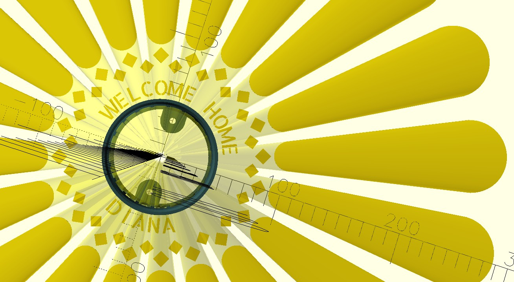

# Modular Projection Lantern Generator

A parametric OpenSCAD project for generating 3D-printable projection lanterns. This generator calculates the precise extrusion angles required to cast undistorted 2D patterns, shapes, and text onto a floor or surface from an elevated point light source.

## OpenSCAD files

| File | Use |
|------|-----|
| **`magicLantern2.scad`** | **Recommended.** Physical settings and render mode at the top; the cutout stack is a single list, `pattern_spec`, built with `layer_*()` helpers. |
| `magicLantern.scad` | Original layout: customize by adding or editing calls inside the `all_2d_patterns()` module. |
| `magicLanternJadeJulian.scad` | Named variant of the original pattern (same `all_2d_patterns()` style). |

Place `AllertaStencil-Regular.ttf` next to whichever `.scad` file you open (see Prerequisites).

## Features

* **Parametric LED mounting:** Adjust variables to friction-fit a LED puck or fixture. Search for “Solar Light Replacement Top 4 Pack (Top Size 3.15 inch, Bottom Size 2.83 inch)” on Amazon as one example.
* **Distortion-corrected projection:** Dynamic scaling keeps patterns farther from the axis visually consistent.
* **Render modes**
  * **`PATTERNS`:** Stack of text, geometry, and rays (in v2, defined in `pattern_spec`).
  * **`SVG`:** Extrude a vector file.
  * **`CAL`:** Shortened body plus a dot spiral to check projection.
* **Mounting tabs** at the base for ceiling or bracket attachment.

## Prerequisites

1. **OpenSCAD:** [openscad.org](https://openscad.org/). For best results, use a recent or nightly build rather than only the 2021 “current” release if you hit quirks.
2. **Allerta Stencil font:** In `PATTERNS` mode, text uses this font so cutouts stay printable (fewer floating islands).
   * Download `AllertaStencil-Regular.ttf` and put it in the same folder as the `.scad` you are editing.
   * The script uses the logical name `"Allerta Stencil"`. Install the font on the system or rely on the local `use <…ttf>` path.

## Quick start

### 1. Configure the light and cylinder

Open **`magicLantern2.scad`** (or your chosen file). Under **Lantern & LED (physical)**, set:

* `light_height` — vertical reference from the bottom of the lantern (floor projection plane, z = 0). Meaning is controlled by `light_height_is_to_rim` (in `magicLantern2.scad` / `magicLantern3.scad`):
  * **`light_height_is_to_rim = false` (default):** `light_height` is floor → **LED emit plane**. The outside rim is `light_height + led_recess`. Changing `led_recess` only deepens the pocket above the LED; projection math uses `light_height` only.
  * **`light_height_is_to_rim = true`:** `light_height` is floor → **outside rim**. The LED emit plane is `light_height - led_recess`, and that value drives projection (`get_floor_r`, taper extrusion, ray preview).
* `cyl_radius`, `wall_thickness` — shell size.
* `led_diameter`, `led_recess`, `tolerance` — friction fit for the puck (`led_recess` = depth of the pocket from the rim toward the LED).

### 2. Choose render mode

Under **What to render on the floor plane**, set `render_mode`:

* `"PATTERNS"` — uses `pattern_spec` (v2) or `all_2d_patterns()` (original files).
* `"SVG"` — set `svg_filename`, `svg_scale`, and offsets.
* `"CAL"` — calibration geometry and shortened cylinder.

### 3. Customize patterns (`magicLantern2.scad`)

Edit the **`pattern_spec`** list: each entry is one `layer_*()` call. Reorder the list to change draw order; duplicate or remove lines to adjust the design.

**Layer builders** (arguments mirror the underlying `project_*` modules):

| Helper | Role |
|--------|------|
| `layer_text(distance, msg, …)` | Ring of characters; optional `t_size`, `kerning_deg`, `phase_shift`, `location` (`"top"` / `"bottom"`). |
| `layer_polygon(distance, vertex, …)` | Repeating polygons; optional `rot`, `n`, `duty`, `phase_shift`. |
| `layer_circles(distance, n, …)` | Repeating circles; optional `duty`, `phase_shift`. |
| `layer_rays(distance, bar_h, n, …)` | Wedges; optional `duty`, `phase_shift`. |

**`distance`** — vertical position of the cut on the wall (smaller = closer to the light = projects farther out on the floor).

**`phase_shift`** — ring rotation, in steps of one angular segment: for rays, circles, and polygons it is `phase_shift × (360/n)` degrees. For text it is `phase_shift × kerning_deg`.

The file defines **`_ray_bar_w`** like the original `width_24` helper; use it in `layer_rays(…, bar_h = _ray_bar_w * 4, …)` when you want bar height tied to cylinder arc width.

If you need a new primitive, add a **`layer_*`** function that returns a tagged list, handle it in **`apply_pattern_entry`**, and append to **`pattern_spec`**. The **`project_*`** modules remain the implementation for each shape type.

### 3b. Original files (`magicLantern.scad`, etc.)

In those files, open the **`all_2d_patterns()`** module and add or change **`project_text`**, **`project_polygon`**, **`project_circles`**, and **`project_rays`** calls. Parameters are the same as in the table above, exposed on the `project_*` modules:

**`project_text()`** — Arc centered at **12 o’clock** (top) or **6 o’clock** (bottom) when `phase_shift` is `0`. Two calls with `location = "top"` and `"bottom"` give two opposite arcs.

* **`msg`** — string to project.
* **`t_size`**, **`kerning_deg`**, **`phase_shift`**, **`location`** — as above; **`f_name`** overrides the global font for that ring.

**`project_polygon()`** — **`vertex`** (e.g. `4` for diamonds), **`rot`**, **`n`**, **`duty`**.

**`project_circles()`** — **`n`**, **`duty`**.

**`project_rays()`** — **`bar_h`** (vertical extent of the cut on the wall), **`n`**, **`duty`**.

### 4. Preview and export

1. **F5** — preview.
2. Set **`show_light_rays = false`** before export so visualization geometry is not merged into the mesh.
3. **F6** — full render.
4. **File → Export** as STL (or 3MF).

## Slicing and printing

* **Resolution:** `$fn = 120` for smooth cylinders; high-res meshes work well in slicers such as OrcaSlicer (seam painting along a tab edge can hide the Z-seam).
* **Material:** PLA is fine for tests and `CAL`. If the LED runs warm, PETG reduces long-term warping.
* **Hardware:** Tested on enclosed Core-XY machines (e.g. FlashForge AD5X).
* **Orientation:** Print vertically, LED cavity up; typical pattern cutouts need no supports.
